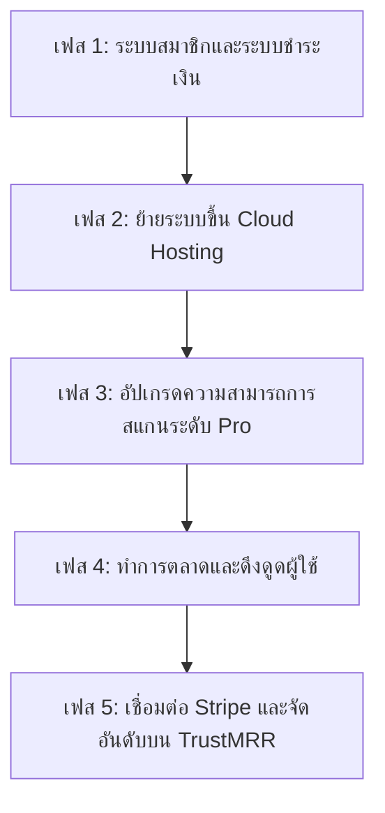

# แผนงานการพัฒนาสู่ระบบ SaaS และการจัดอันดับบน TrustMRR
(Roadmap: Converting MVP to Commercial SaaS & TrustMRR Listing)

เอกสารนี้แสดงรายละเอียดขั้นตอนทางเทคนิคและการวางกลยุทธ์เพื่อนำแพลตฟอร์ม **Affiliate Link Integrity & Health Checker** ก้าวสู่การเป็นบริการซอฟต์แวร์เชิงพาณิชย์ (SaaS) เพื่อสร้างรายได้จริงและนำขึ้นไปจัดอันดับบน [TrustMRR.com](https://trustmrr.com/)

---

## 🚀 แผนงานภาพรวม (High-Level Milestones)

---

## 🛠️ รายละเอียดแต่ละเฟส (Technical & Business Plan)

### เฟสที่ 1: ระบบสมาชิกและระบบชำระเงิน (Auth & Subscription Billing)
*   **ระบบสมัครสมาชิก (User Authentication)**:
    *   เปลี่ยนจากการใช้ API Key (tenant UUID) เปลือย ๆ เป็นระบบ Login/Register มาตรฐาน
    *   *เทคโนโลยีแนะนำ*: **Supabase Auth** (ใช้งานง่ายและฟรีสำหรับระดับเริ่มต้น) หรือ **Next-Auth/Auth0**
*   **การเชื่อมต่อระบบรับเงิน (Stripe / LemonSqueezy Integration)**:
    *   สร้างระบบ Pricing Plans (เช่น Free Plan สแกนได้ 100 ลิงก์ต่อวัน / Pro Plan $19/เดือน สแกนได้ 5,000 ลิงก์ทุกชั่วโมง)
    *   สร้าง API Endpoint รองรับ **Stripe Webhooks** เมื่อเกิดเหตุการณ์การชำระเงินสำเร็จ (เช่น `customer.subscription.created` หรือ `invoice.paid`) เพื่ออัปเดตสิทธิ์การใช้งานของ Tenant ในฐานข้อมูลโดยอัตโนมัติ

---

### เฟสที่ 2: การโฮสต์และขึ้นระบบออนไลน์ (Production Cloud Deployment)
ย้ายการรันระบบภายในเครื่องคอมพิวเตอร์ของคุณขึ้นไปอยู่บนคลาวด์เพื่อให้ลูกค้าเข้าใช้งานได้จากทั่วโลกตลอด 24 ชั่วโมง:

*   **Database**: ย้ายจาก local PostgreSQL ไปใช้บริการฐานข้อมูลแบบจัดการสำเร็จรูป เช่น **Neon.tech** (Serverless Postgres) หรือฐานข้อมูลบน **Supabase**
*   **FastAPI backend & Worker**: รันบน **Railway.app** หรือ **Render.com** ซึ่งรองรับการดึงโค้ดจาก GitHub ไปสร้างเป็น Docker Container รันบนอินเทอร์เน็ตได้ทันที
*   **Celery Queue (Redis)**: ใช้บริการ **Upstash Redis** (เป็น Serverless Redis มีโควตาฟรีและจ่ายตามการใช้งานจริง ปลอดภัยและเหมาะกับงาน Queue เบื้องหลัง)

---

### เฟสที่ 3: อัปเกรดระบบเพื่อสู้กับคู่แข่งทางตรง (Core Feature Upgrades)
เพื่อให้สามารถคิดค่าบริการระดับ Pro ได้อย่างเต็มภาคภูมิ ระบบสแกนต้องรองรับคุณสมบัติเหล่านี้:

*   **Geo-Targeting / Mobile Proxy Checks**:
    *   *ทำไมต้องใช้*: ลิงก์ Affiliate ของบางแบรนด์จะ redirect ไปหน้าเว็บแตกต่างกันขึ้นอยู่กับ "ประเทศ" และ "อุปกรณ์" ของคนคลิก
    *   *แนวทาง*: เพิ่มการจำลองการเปลี่ยน User-Agent เป็นมือถือและแท็บเล็ต และส่งบอทผ่าน Proxy เพื่อสแกนดูปลายทางของแต่ละภูมิภาค (เช่น ตรวจสอบปลายทางของคนคลิกจากไทย สหรัฐฯ หรือสิงคโปร์)
*   **WordPress Plugin (เพื่อหาลูกค้า)**:
    *   สร้างปลั๊กอินอย่างง่ายสำหรับ WordPress (ซึ่งเป็น CMS ยอดนิยมในการทำเว็บบล็อกและ affiliate) เพื่อส่งลิงก์จากหน้าบทความเข้ามาตรวจสุขภาพและรายงานผลความผิดปกติกลับไปในหน้า Dashboard ของ WordPress ได้โดยตรง

---

### เฟสที่ 4: การขอขึ้นทะเบียนและเคลมอันดับบน TrustMRR.com
เมื่อระบบของคุณเริ่มให้บริการแบบเก็บเงินจริงและมีรายได้เข้ามาจริงผ่านบัญชี Stripe:

1.  **สมัครบัญชีผู้ก่อตั้ง**: เข้าไปที่เว็บ [TrustMRR.com](https://trustmrr.com/) สมัครบัญชีและกรอกข้อมูลบริการของคุณ
2.  **การเชื่อมต่อรายได้ (Revenue Verification)**:
    *   TrustMRR จะไม่ยอมรับรายได้แบบกรอกตัวเลขเอง แต่จะให้เชื่อมต่อ Stripe บัญชีจริงของคุณผ่านการใส่ Stripe Restricted API Key (ซึ่งมีสิทธิ์อ่านยอดเงินเข้าเท่านั้น ปลอดภัยต่อระบบความปลอดภัยของคุณ)
3.  **การจัดอันดับ (Ranking leaderboard)**:
    *   เมื่อรายได้ถูกเชื่อมต่ออย่างถูกต้อง ระบบ TrustMRR จะนำยอด MRR (Monthly Recurring Revenue) ไปจัดอันดับอยู่บนบอร์ดของผู้ก่อตั้งทั่วโลก
    *   บอร์ดนี้จะเป็นหน้าต่างสำคัญที่ทำให้นักลงทุน, ลูกค้ากลุ่มแรก (Early adopters) และกลุ่ม Indie Hackers รู้จักแพลตฟอร์มของคุณ และนำพาทราฟฟิกกลับมายังเว็บหลักได้แบบก้าวกระโดด
